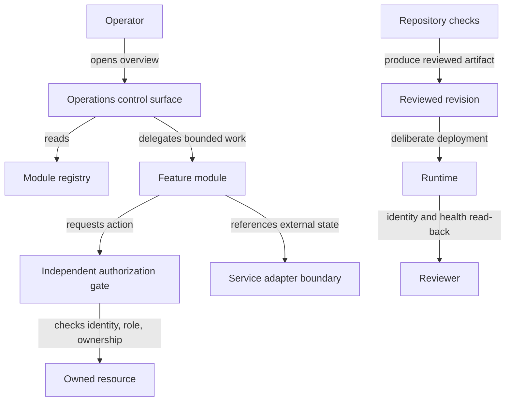

# Representative control-plane architecture

This diagram is a synthetic description of module and verification boundaries.
It does not describe a production network, route, host, vendor, or data flow.

## Text equivalent

An operator opens an operations control surface. The surface reads a module
registry for discovery and delegates bounded work to a feature module. When the
module requests an action, an independent authorization gate verifies identity,
role, and resource ownership before reaching an owned resource. The module may
refer to external state through a service-adapter boundary, but that external
system remains authoritative for its own record.

Separately, repository checks produce a reviewed revision. A deliberate
deployment moves that revision toward a runtime. A reviewer reads back runtime
identity and health rather than assuming that review or merge proved live state.

## Boundary summary

| Boundary | Owns | Does not own |
| --- | --- | --- |
| Control surface | Module discovery and operator navigation | External service records |
| Feature module | Its domain behavior and presentation | Global authorization policy |
| Authorization gate | Identity, role, and ownership decision | Page layout or navigation |
| Service adapter | Local contract and failure translation | Provider behavior |
| Repository checks | Code-level and policy evidence | Deployment or runtime truth |
| Deployment verification | Revision identity and targeted read-back | Business outcome evidence |

## Publication limits

The diagram deliberately omits production topology, access paths,
authentication mechanics, providers, data fields, recovery procedures, and
interface design. The prose above contains the same relationships, so the
architecture remains understandable when Mermaid is not rendered.
